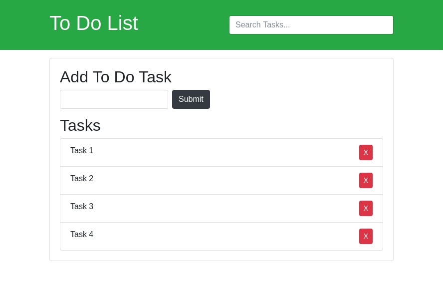

# to-do-list
This app was built based of [Brad Traversy's project](https://www.youtube.com/watch?v=i37KVt_IcXw&index=8&list=PLillGF-RfqbbnEGy3ROiLWk7JMCuSyQtX).

The app is a simple to do list. Users can add, remove, and filter tasks. It was built using Vanilla JS and Bootstrap 4.

## Installation
Clone/Download the repo then launch the index.html in a modern web browser.
